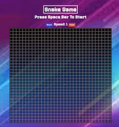

# Description:
Snake game for the browser using vanilla JS and basic HTML and CSS. There was a heavy emphasis on OOP when creating this small app. 

The game mechanics and rules are explained in detail in [UPenn's 2008 assignment on the topic](https://www.cis.upenn.edu/~matuszek/cit591-2008/Assignments/11-snake.html)

### Technologies and Languages Used:
- HTML
- CSS
- Javascript

# Motivation:
I grew up on the [Snake Game](https://en.wikipedia.org/wiki/Snake_(video_game_genre)) on my small Nokia phone. As such, it was nice to come back and make something I played so much as a kid.

# Screenshot of Game:

# Attributions:
- Sounds taken from [Mixkit](https://mixkit.co/free-sound-effects/game)

# Getting Started
Use the up, down, right, left buttons or W, S, D, A keys to move around.
[Click here to play game](http://www.retro-snake-game.surge.sh)

# Pseudo-code:
1. Snake will be an object/class with the following states:
   1. Length of snake
   2. Snake speed variable?
   3. The direction the snake is going
   4. Position (a 2D array of all its cell positions or a array of objects that have an x, y key)
      1. On initialization it will randomly pick a position
   5. isDead state (boolean)
   6. Reset position function
   7. Simple getter function that gets the head
   8. A turn function to change where the snake moves
      1. Check if new head position is in positions array, and if so snake dead
      2. turn function will take a direction as parameter
         1. This will be passed by EventListeners for keyup
         2. Use event.keyCode to determine the direction
         3. Snake head moves in that direction
            1. The other segments move to previous's position
   9. A move function that just moves the snake on that trajectory
      1.  move just moves the segments up-down right-left depending on direction
2. Game field will be a grid of cells
   1. Food cells will be red
   2. Cells that the snake occupies will be green
   3. Empty cells will be grey
   4. It will be a grid of divs
      1. Traversing the grid would work like a 2D array
      2. Each div has class cell
      [Possible: make each row a separate div with class row?]
3. When snake is at the edge of the screen, it will loop back to beginning
   1. This can be accomplished by using modulo on the grid row/column + 1
4. Food will be placed randomly on the game board (assuming nothing is in that cell)
   1. It will check whether the snake is in that space
5. Init functions will initialize everything to their starting positions
   1. Re-initialize the grid
   2. Re-initialize the snake
   3. Call random placement of food
6. Score keeping function (how score is calculated TBD)
7. Reset button with EventListener
8. Start game button with EventListener that uses while loop to continually run game and move the snake
   1. while loop's condition is the snake's "dead" state
   2. remove snake class from div as snake moves
9.  Check if snake is "dead"
   3. If so, then call render end game
10. Render function will handle rendering everything
   4. Render the different colors for the div cells
      1. If food div needs to be rendered (after previous one being eaten), then render it in it's random spot
      2. Render the snake in it's moved position
      3. If food eaten in previous state, then remove the color of the food (use remove from classList)
   5. Separate render functions for snake and food
   6. Render function for end of game
   7. Render points in score based on food eaten
11. Directions will be a 2D array of up-down, right-left

# Sketch Goals:
1. ~~Being able to control the speed of the snake~~
2. ~~Snake speed increases as he eats~~
3. ~~Audio related to losing and points added~~
